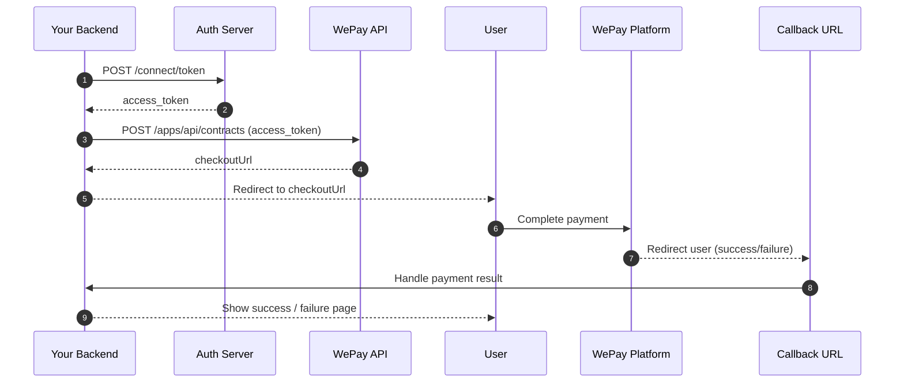

# For Third-Party Developers - Integration Guide

This section is for developers integrating WePay Escrow Payment Services into their applications.

## Version
current version: v1.3.0 <br/>
last updated date: 09/04/2026

## Change Log


| Version        | What to Include              |
| -------------- | ---------------------------- |
| Minor (v1.3.0) | KYC integration			 |
| Minor (v1.2.0) | Add milestone to contract APIs |
| Minor (v1.1.0) | Webhook notifications support |
| Major (v1.0.0) | checkout on contract level public              |


[[_TOC_]]


## Overview

To integrate WePay payment services, you need to:

- Obtain an access token using client credentials
- Create a contract using the API
- Redirect users to the checkout URL provided in the response
- (Optional) Set up [Webhook Notifications](webhook.md) for real-time event updates

## Step 1: Obtain Access Token

Before making any API calls, you need to authenticate and obtain an access token.

### Endpoint

`POST /connect/token`

**Headers**:
- content-type: application/x-www-form-urlencoded
- grant_type: client_credentials
- client_id: YOUR_CLIENT_ID
- client_secret: YOUR_CLIENT_SECRET  

**Where to get Client ID and Client Secret:**

- These credentials are generated when you create a business account on the WePay platform
- Contact WePay support to obtain these credentials

### Example Request (cURL)

```
curl -X POST " https://test-api.welink-sa.com/connect/token" \
  -H "Content-Type: application/x-www-form-urlencoded" \
  -d "grant_type=client_credentials" \
  -d "client_id=YOUR_CLIENT_ID" \
  -d "client_secret=YOUR_CLIENT_SECRET"

```

### Example Response
```
{  
"access_token": "eyJhbGciOiJSUzI1NiIsImtpZCI6IjBNVUdGT1IxSjlWSURKVlFISV9UMjFfSlBDVTA5WlotS0dFQVRHWDciLCJ0eXAiOiJhdCtqd3QifQ...",  
"token_type": "Bearer",  
"expires_in": 1440  
}
```
**Response Fields:**

- **access_token**: The bearer token to use for authenticated API requests
- **token_type**: Always "Bearer" for this authentication method
- **expires_in**: Token expiration time in minutes (1440 = 24 hours)

**Important Notes:**

- Store the access token securely
- Tokens expire after the time specified in `expires_in` (typically 24 hours)
- You'll need to request a new token when it expires
- Never expose your client_secret in client-side code

## Step 2: Create a Contract

After obtaining the access token, use it to create a payment contract.

### Endpoint

`POST /apps/api/contracts`  

**Headers**
- Authorization: Bearer {access_token}  
	Replace {access_token} with the token obtained from login [(Step 1)](#Step-1-Obtain-Access-Token).

- Content-Type: application/json   

### Request Body
```
{
    "title": "Sell a property111",
    "contractServiceType": "Product",
    "BuyerParty": {
		"platformRefId" : "USR_abc001",	//Optional.
        "phoneNumber": "966583944460",	//Required if platformRefId is not provided
        "firstName": "Buyer",			//Required if platformRefId is not provided
        "lastName": "Name"				//Required if platformRefId is not provided
    },
    "SellerParty": {
		"platformRefId" : "USR_abc002",	//Optional.
        "phoneNumber": "966583944461",	//Required if platformRefId is not provided
        "firstName": "Seller",			//Required if platformRefId is not provided
        "lastName": "",					//Required if platformRefId is not provided
		"KYC": 
	    {
	        "identity": "5232210232",
	        "iBANNumber": "8995422365998855663",
	        "bICCode": "8888",
	        "dateOfBirth": "2000-01-01T10:27:39.889Z"
	    }
    },
    "amount": 1000,
    "description": "Extenal Iphone mobile",
    "notes": "notes for mobile",
    "reference": "12321",
    "metaData": {
        "metadata1": "1",
        "metadata2": "2",
        "metadata3": "",
        "metadata4": ""
    },
    "callbackUrl": "http://localhost:3000/callback",
	"Milestones": [
		{
			"Name": "milestone 1 name",
			"Description": "milestone 1 description",
			"Amount": 600,
			"DueDate": "2026-12-20T10:00:00.000Z"
    	},
		{
			"Name": "milestone 2 name",
			"Description": "milestone 2 description",
			"Amount": 400,
			"DueDate": "2026-12-31T09:35:30.369Z"
    	}
	]
}
```
### Field Descriptions

| Field Name | Type | Description | Required / Notes / Example |
| --- | --- | --- | --- |
| title | string | Contract title | **Required**<br/>Example: "Sell a property111" |
| contractServiceType | string | Type of service for the contract | **Required**<br/>Expected Values: "Product", "Service" |
| BuyerParty | object (Party) | Buyer information | **Required** |
| SellerParty | object (Party) | Seller information | **Required** |
| amount | number | Contract amount | **Required**<br/>Example: 1000 |
| description | string | Contract description | Optional<br/>Example: "Extenal Iphone mobile" |
| notes | string | Additional notes | Optional<br/>Example: "notes for mobile" |
| reference | string | External reference identifier | Optional<br/>Example: "12321" |
| metaData | object (MetaData) | Custom key-value metadata | Optional |
| callbackUrl | string | Callback URL for contract events | Optional<br/>Example: "<http://localhost:3000/callback>" | 
Milestones | list of objects (Milestone) | Seperate contract into multiple milestones | Optional |

**Party (BuyerParty / SellerParty)**

| Field Name | Type | Description | Required / Notes / Example |
| --- | --- | --- | --- |
| platformRefId* | string | User identifier in wepay system | Optional |
| phoneNumber | string | Party phone number (including country code) | **Required if platformRefId is not provided**<br/>Example: "966583944460" |
| firstName | string | First name | **Required if platformRefId is not provided**<br/>Example: "Ahmad" |
| lastName | string | Last name | **Required if platformRefId is not provided**<br/>Example: "Ali" |

*platformRefId is optional in the request. It is a unique identifier across all parties in the system. It can be used to link the party to an existing user in your system or to store a reference for future lookups.

To get platformRefId, you can call the [User Onboarding API](#Get-User-Onboarding-Status) to retrieve a user and obtain his platformRefId, if exists.

You can also choose to not provide platformRefId in the request, or just provide the party's phone number and name and WePay will try to find an existing user with the same phone number. If the user is a new one, it will be created automatically in the system and a new platformRefId will be generated for him, and will be returned in the response. You can then store this platformRefId in your system for future reference.

If you want to create a user in Wepay and get the platformRefId before creating a contract, you can use the [User Creation API](#Create-User) to create a new user and get his platformRefId, then use this platformRefId in the contract creation request.

**Note:** On contract creation, the seller receives an SMS with a [KYC](#KYC-Flow) link to verify his identity.

**Party (SellerParty)**
| Field Name | Type | Description | Required / Notes / Example |
| --- | --- | --- | --- |
| kyc | object | kyc data for seller | Required |

**Kyc object**
| Field Name | Type | Description | Required / Notes / Example |
| --- | --- | --- | --- |
| identity | string | Seller national id | Required |
| iBANNumber | string | Seller bank account IBAN | Required |
| bICCode | string | Seller bank account BIC | Required |
| dateOfBirth | datetime | Seller date of birth | Optional |

**MetaData**

| Field Name | Type | Description | Required / Notes / Example |
| --- | --- | --- | --- |
| metadata1 | string | Custom metadata field | OptionalExample: "1" |
| metadata2 | string | Custom metadata field | OptionalExample: "2" |
| metadata3 | string | Custom metadata field | OptionalExample: "" |
| metadata4 | string | Custom metadata field | OptionalExample: "" |

**Milestone**
| Field Name | Type | Description | Required / Notes / Example |
| --- | --- | --- | --- |
| Name | string | Milestone name | **Required** OptionalExample: "milestone 1 name" |
| Description | string | Milestone Description | OptionalExample: "milestone 1 description" |
| Amount | Number | Milestone amount | **Required** OptionalExample: 600 <br> **Note:** Must be lower than contract amount and the total of all milestones amounts must be equal to the contract amount |
| DueDate | string (date-time) | Contract creation timestamp (UTC) | **Required**<br>Example: 2026-12-20T10:00:000Z |

## Response: 

**Result&lt;ExternalCreateContractResponse&gt;**

| Field Name | Type | Description | Required / Notes / Example |
| --- | --- | --- | --- |
| succeeded | boolean | Indicates whether the request was successful | **Required**<br/>Example: true |
| message | string | Result message | Optional<br/>Example: "Contract created successfully" |
| errors | array of string | List of validation or business errors | Optional |
| data | object (ExternalCreateContractResponse) | Contract creation result data | Optional |

**ExternalCreateContractResponse**

| Field Name | Type | Description | Required / Notes / Example |
| --- | --- | --- | --- |
| contractId | string | Unique external contract identifier | **Required**<br><br>Example: "c8f1a3c2-9d12-4c8b-9f0a-123456789abc" |
| status | string (ContractStatus) | Current contract status | **Required**<br><br>Example: "Pending" |
| contractServiceType | string (ContractServiceType) | Type of contract service | **Required**<br><br>Example: "Product" |
| checkoutUrl | string | Checkout URL for completing payment | **Required**<br><br>Example: "<https://integration.wepay-sa.com/checkout?token=encodedToken>" <br /> The **token** is valid for 10 minutes. If expired, you need to [request a new one](#Step-4-Request-a-New-Checkout-Token-If-Expired) by calling `/apps/api/contracts/checkout` |
| buyerParty | object (ExternalContractParty) | Buyer party details | **Required** |
| sellerParty | object (ExternalContractParty) | Seller party details | **Required** |
| reference | string | External reference identifier | Optional Nullable |
| metaData | object (ContractMetaData) | Custom metadata | Optional Nullable |
| milestones | array of Milestone | Contract milestones | **Required** |
| pricingLineItems | array of ExternalPriceLineItem | Pricing breakdown items | **Required** |
| createdDate | string (date-time) | Contract creation timestamp (UTC) | **Required**<br><br>Example: 2024-01-15T10:30:00Z |

**ExternalContractParty**

| Field Name | Type | Description | Required / Notes / Example |
| --- | --- | --- | --- |
| platformRefId | string | User identifier in wepay | **Required** |
| firstName | string | First name | **Required**<br/>Example: "Ahmad" |
| lastName | string | Last name | **Required**<br/>Example: "Ali" |
| phoneNumber | string | Phone number including country code | **Required**<br/>Example: "966583944460" |

**ContractMetaData**

| Field Name | Type | Description | Required / Notes / Example |
| --- | --- | --- | --- |
| metadata1 | string | Custom metadata field | Optional |
| metadata2 | string | Custom metadata field | Optional |
| metadata3 | string | Custom metadata field | Optional |
| metadata4 | string | Custom metadata field | Optional |

**Milestone**

| Field Name | Type | Description | Required / Notes / Example |
| --- | --- | --- | --- |
| Id | number | Milestone identifier | **Required**<br>Example: 13 |
| name | string | Milestone name | **Required**<br><br>Example: "Delivery" |
| description | string | Milestone description | Optional |
| amount | number | Milestone amount | **Required**<br><br>Example: 500 |
| dueDate | string (date-time) | Milestone due date (UTC) | **Required**<br><br>Example: 2024-02-01T00:00:00Z |
| pricingLineItems | array of ExternalPriceLineItem | Pricing breakdown items | **Required** |

### Milestone Validation Rules

| Rule | Requirement |
|------|-------------|
| Total amounts | Must equal contract amount |
| Milestone amount | Must be > 0 |
| DueDate format | ISO 8601 UTC (with Z suffix) |
| Name | Required field |
| Description | Optional field |

### Important: Milestone Amount Calculation

**Request `Amount`** = Base contract amount  
**Response `Amount`** = Base + all fees + taxes

**Example**:
- Request: 600 SAR (base)
- Response: 686.25 SAR (includes escrow fees, platform fees, VAT)

See `PricingLineItems` array for full breakdown.

**ExternalPriceLineItem**

| Field Name | Type | Description | Required / Notes / Example |
| --- | --- | --- | --- |
| lineType | string (PricingLineType) | Pricing line type | **Required**<br><br>Example: "EscrowFee" |
| LineTypeDescription | string | Pricing line type description | **Required** |
| role | string (PricingRole) | Party responsible for the amount | **Required**<br><br>Example: "Buyer" |
| RoleDescription | string | Role description | **Required** |
| amount | number | Amount value | **Required**<br><br>Example: 50 |
| description | string | Pricing line description | Optional |
| order | integer | Display order | **Required**<br><br>Example: 1 |

### Example Request (cURL)
```
curl -X POST "https://api.wepay.com.sa/apps/api/contracts" \
  -H "Authorization: Bearer YOUR_ACCESS_TOKEN" \
  -H "Content-Type: application/json" \
  -d '{
    "title": "TEST Sell a property111",
    "contractServiceType": "Product",
    "BuyerParty": {
      "phoneNumber": "966583944460",
      "firstName": "Buyer",
      "lastName": "Name aa"
    },
    "SellerParty": {
      "phoneNumber": "966583944461",
      "firstName": "Seller",
      "lastName": ""
    },
    "amount": 1000,
    "description": "TEST External Iphone mobile",
    "notes": "notes for mobile",
    "callbackurl": "http://localhost:3000/en/payment-success",
    "Milestones": [
      {
        "Name": "milestone 1 name",
        "Description": "milestone 1 description",
        "Amount": 600,
        "DueDate": "2026-12-20T10:00:00.000Z"
      },
      {
        "Name": "milestone 2 name",
        "Description": "milestone 2 description",
        "Amount": 400,
        "DueDate": "2026-12-31T09:35:30.369Z"
      }
    ]
  }'
```

**Note**: API uses camelCase for JSON responses:
- Request: `"Milestones"` (PascalCase - C# convention)
- Response: `"milestones"` (camelCase - JSON convention)

**DueDate Format**: Always use UTC timezone
- Example: `"2026-12-20T10:00:00.000Z"`
- System converts to Saudi time (UTC+3) for display

**Note**: Milestones are read-only after contract creation.

### Example Response

```
{
	"data": {
		"contractId": "CNT-2601-00100003",
		"status": "pending",
		"contractServiceType": "product",
		"checkoutUrl": "<https://checkout.welink-sa.com?token=RSGFF38PXVO>....",
		"buyerParty": {
			"platformRefId": "USR_20260405152053_5487",
			"firstName": "Buyer",
			"lastName": "Name aa",
			"phoneNumber": "966583944460"
		},
		"sellerParty": {
			"platformRefId": "USR_20260405151029_7034",
			"firstName": "Seller",
			"lastName": "",
			"phoneNumber": "966583944461"
		},
		"reference": "12321",
		"metaData": {
			"metadata1": "1",
			"metadata2": "2",
			"metadata3": "",
			"metadata4": ""
		},
		"milestones": [
			{
				"Id": 12,
				"Name": "milestone 1 name",
				"Description": "milestone 1 description",
				"DueDate": "2026-12-20T10:00:00.000Z",
				"Amount": 686.25,
				"PricingLineItems": [
					{
						"lineType": "contractAmount",
						"role": "buyer",
						"amount": 600,
						"description": null,
						"order": 1
					},
					{
						"lineType": "escrowFee",
						"role": "thirdParty",
						"amount": 15.0,
						"description": null,
						"order": 2
					},
					{
						"lineType": "escrowFeeTax",
						"role": "thirdParty",
						"amount": 2.25,
						"description": null,
						"order": 3
					},
					{
						"lineType": "externalPlatformFee",
						"role": "buyer",
						"amount": 60.00,
						"description": null,
						"order": 4
					},
					{
						"lineType": "externalPlatformFeeTax",
						"role": "buyer",
						"amount": 9.00,
						"description": null,
						"order": 5
					},
					{
						"lineType": "netEscrowAmountToSeller",
						"role": "seller",
						"amount": 600,
						"description": null,
						"order": 6
					}
				]
			},
			{
				"Id": 13,
				"Name": "milestone 2 name",
				"Description": "milestone 2 description",
				"DueDate": "2026-12-31T09:35:30.369Z",
				"Amount": 457.5,
				"PricingLineItems": [
					{
						"lineType": "contractAmount",
						"role": "buyer",
						"amount": 400,
						"description": null,
						"order": 1
					},
					{
						"lineType": "escrowFee",
						"role": "thirdParty",
						"amount": 10.00,
						"description": null,
						"order": 2
					},
					{
						"lineType": "escrowFeeTax",
						"role": "thirdParty",
						"amount": 1.50,
						"description": null,
						"order": 3
					},
					{
						"lineType": "externalPlatformFee",
						"role": "buyer",
						"amount": 40.00,
						"description": null,
						"order": 4
					},
					{
						"lineType": "externalPlatformFeeTax",
						"role": "buyer",
						"amount": 6.00,
						"description": null,
						"order": 5
					},
					{
						"lineType": "netEscrowAmountToSeller",
						"role": "seller",
						"amount": 400,
						"description": null,
						"order": 6
					}
				]
			}
		],
		"pricingLineItems": [
			{
				"lineType": "contractAmount",
				"role": "buyer",
				"amount": 1000,
				"description": null,
				"order": 1
			},
			{
				"lineType": "escrowFee",
				"role": "thirdParty",
				"amount": 25.0,
				"description": null,
				"order": 2
			},
			{
				"lineType": "escrowFeeTax",
				"role": "thirdParty",
				"amount": 3.75,
				"description": null,
				"order": 3
			},
			{
				"lineType": "externalPlatformFee",
				"role": "buyer",
				"amount": 100.0,
				"description": null,
				"order": 4
			},
			{
				"lineType": "externalPlatformFeeTax",
				"role": "buyer",
				"amount": 15.0,
				"description": null,
				"order": 5
			},
			{
				"lineType": "netEscrowAmountToSeller",
				"role": "seller",
				"amount": 1000,
				"description": null,
				"order": 6
			}
		],
		"createdDate": "2026-01-25T10:28:10.4874015Z"
	},
	"message": "Contract created successfully.",
	"status": 200,
	"validationErrors": []
}
```

## Get Contract
in case you want to get previously created contract by contract id, you can use the following endpoint 

**Endpoint** `GET {{baseUrl}}/apps/api/contracts/CNT-2601-00100002`
Curl:
```
```bash
curl -X 'GET' \
  '{{baseUrl}}/apps/api/contracts/CNT-2601-00100002' \
  -H 'accept: application/json'
```
**Response**
```
{
	"data": {
		"contractId": "CNT-2601-00100002",
		"reference": "12321",
		"title": "Sell a property111",
		"description": "Extenal Iphone mobile",
		"notes": "notes for mobile",
		"status": "pending",
		"contractServiceType": "product",
		"buyerParty": {
			"platformRefId": "USR_123",
			"firstName": "Buyer",
			"lastName": "Name aa",
			"phoneNumber": "966583944460"
		},
		"sellerParty": {
			"platformRefId": "USR_456",
			"firstName": "Seller",
			"lastName": "",
			"phoneNumber": "966583944461"
		},
		"businessName": "new 555",
		"createdDate": "2026-01-24T17:48:58.64975+01:00",
		"metaData": {
			"metadata1": "1",
			"metadata2": "2",
			"metadata3": "",
			"metadata4": ""
		},
		"milestones": [
			{
				"Id": 12,
				"Name": "milestone 1 name",
				"Description": "milestone 1 description",
				"DueDate": "2026-12-20T10:00:00.000Z",
				"Amount": 686.25,
				"PricingLineItems": [
					{
						"lineType": "contractAmount",
						"role": "buyer",
						"amount": 600,
						"description": null,
						"order": 1
					},
					{
						"lineType": "escrowFee",
						"role": "thirdParty",
						"amount": 15.0,
						"description": null,
						"order": 2
					},
					{
						"lineType": "escrowFeeTax",
						"role": "thirdParty",
						"amount": 2.25,
						"description": null,
						"order": 3
					},
					{
						"lineType": "externalPlatformFee",
						"role": "buyer",
						"amount": 60.00,
						"description": null,
						"order": 4
					},
					{
						"lineType": "externalPlatformFeeTax",
						"role": "buyer",
						"amount": 9.00,
						"description": null,
						"order": 5
					},
					{
						"lineType": "netEscrowAmountToSeller",
						"role": "seller",
						"amount": 600,
						"description": null,
						"order": 6
					}
				]
			},
			{
				"Id": 13,
				"Name": "milestone 2 name",
				"Description": "milestone 2 description",
				"DueDate": "2026-12-31T09:35:30.369Z",
				"Amount": 457.5,
				"PricingLineItems": [
					{
						"lineType": "contractAmount",
						"role": "buyer",
						"amount": 400,
						"description": null,
						"order": 1
					},
					{
						"lineType": "escrowFee",
						"role": "thirdParty",
						"amount": 10.00,
						"description": null,
						"order": 2
					},
					{
						"lineType": "escrowFeeTax",
						"role": "thirdParty",
						"amount": 1.50,
						"description": null,
						"order": 3
					},
					{
						"lineType": "externalPlatformFee",
						"role": "buyer",
						"amount": 40.00,
						"description": null,
						"order": 4
					},
					{
						"lineType": "externalPlatformFeeTax",
						"role": "buyer",
						"amount": 6.00,
						"description": null,
						"order": 5
					},
					{
						"lineType": "netEscrowAmountToSeller",
						"role": "seller",
						"amount": 400,
						"description": null,
						"order": 6
					}
				]
			}
		],
		"pricingLineItems": [
			{
				"lineType": "contractAmount",
				"role": "buyer",
				"amount": 1000,
				"description": null,
				"order": 1
			},
			{
				"lineType": "escrowFee",
				"role": "thirdParty",
				"amount": 25.0,
				"description": null,
				"order": 2
			},
			{
				"lineType": "escrowFeeTax",
				"role": "thirdParty",
				"amount": 3.75,
				"description": null,
				"order": 3
			},
			{
				"lineType": "externalPlatformFee",
				"role": "buyer",
				"amount": 100.0,
				"description": null,
				"order": 4
			},
			{
				"lineType": "externalPlatformFeeTax",
				"role": "buyer",
				"amount": 15.0,
				"description": null,
				"order": 5
			},
			{
				"lineType": "netEscrowAmountToSeller",
				"role": "seller",
				"amount": 1000,
				"description": null,
				"order": 6
			}
		],
		"transactions": []
	},
	"message": "ContractRetrievedSuccessfully",
	"status": 200,
	"validationErrors": []
}

```
 **Response Fields Description**
`Result<GetContractResponse>`
| Field Name | Type                         | Description                                  | Required / Notes / Example |
| ---------- | ---------------------------- | -------------------------------------------- | -------------------------- |
| succeeded  | boolean                      | Indicates whether the request was successful | **Required**               |
| message    | string                       | Response message                             | Optional                   |
| errors     | array of string              | Errors if the request failed                 | Optional                   |
| data       | object (GetContractResponse) | Contract details                             | Optional                   | 


`GetContractResponse`
| Field Name          | Type                                     | Description                      | Required / Notes / Example |
| ------------------- | ---------------------------------------- | -------------------------------- | -------------------------- |
| id                  | string (GUID)                            | Contract identifier              | **Required**               |
| title               | string                                   | Contract title                   | **Required**               |
| description         | string                                   | Contract description             | Optional                   |
| notes               | string                                   | Additional notes                 | Optional                   |
| amount              | number                                   | Total contract amount            | **Required**               |
| status              | string (ContractStatus)                  | Current contract status          | **Required**               |
| contractServiceType | string (ContractServiceType)             | Contract service type            | **Required**               |
| reference           | string                                   | External reference               | Optional                   |
| buyerParty		  | object (ExternalContractParty)           | Buyer party details              | **Required**               |
| sellerParty         | object (ExternalContractParty)           | Seller party details             | **Required**               |
| metaData            | object (ContractMetaData)                | Custom metadata                  | Optional                   |
| milestones          | array of ContractMilestoneResponse       | Contract milestones              | **Required**               |
| pricingLineItems    | array of PricingLineItemResponse | Pricing breakdown                | **Required**               |
| createdDate         | string (date-time) (UTC)                      | Contract creation date (UTC)     | **Required**               |
| updatedDate         | string (date-time) (UTC)                      | Last update date (UTC)           | **Required**               |

`ExternalContractParty`
| Field Name  | Type   | Description                    | Required / Notes / Example |
| ----------- | ------ | ------------------------------ | -------------------------- |
| platformRefId | string | User identifier in wepay 	| **Required** 				 |
| firstName   | string | First name                     | **Required**               |
| lastName    | string | Last name                      | Optional                   |
| phoneNumber | string | Phone number with country code | **Required**               |

`ContractMetaData`
| Field Name | Type   | Description     | Required / Notes / Example |
| ---------- | ------ | --------------- | -------------------------- |
| metadata1  | string | Custom metadata | Optional                   |
| metadata2  | string | Custom metadata | Optional                   |
| metadata3  | string | Custom metadata | Optional                   |
| metadata4  | string | Custom metadata | Optional                   |

`ContractMilestoneResponse`

| Field Name  | Type               | Description           | Required / Notes / Example |
| ----------- | ------------------ | --------------------- | -------------------------- |
| id          | string (GUID)      | Milestone identifier  | **Required**               |
| name        | string             | Milestone name        | **Required**               |
| description | string             | Milestone description | Optional                   |
| amount      | number             | Milestone amount      | **Required**               |
| status      | string             | Milestone status      | **Required**               |
| dueDate     | string (date-time (UTC)) | Milestone due date    | **Required**               |
| pricingLineItems    | array of PricingLineItemResponse | Pricing breakdown                | **Required**               |

`PricingLineItemResponse`

| Field Name  | Type          | Description                   | Required / Notes / Example |
| ----------- | ------------- | ----------------------------- | -------------------------- |
| id          | string (GUID) | Pricing line identifier       | **Required**               |
| lineType    | string        | Pricing line type             | **Required**               |
| role        | string        | Party responsible for the fee | **Required**               |
| amount      | number        | Amount value                  | **Required**               |
| description | string        | Pricing line description      | Optional                   |
| order       | integer       | Display order                 | **Required**               |


`HTTP Status Codes`

| Status Code | Description                     |
| ----------- | ------------------------------- |
| 200         | Contract retrieved successfully |
| 404         | Contract not found              |
| 400         | Invalid contract ID             |
| 401         | Unauthorized                    |
| 500         | Internal server error           |


## Step 3: Redirect Users to Checkout

After receiving the response, extract the `checkoutUrl` from `data.checkoutUrl` and redirect your users to this URL.

### Implementation Examples

**HTML Link:**

```
<a href="https://checkout.wepay.com.sa?token=...">Pay with WePay</a>
```

**JavaScript Redirect:**
```
// After receiving the API response  
const checkoutUrl = response.data.checkoutUrl;  
window.location.href = checkoutUrl;
```

**React/Next.js:**
```
// After receiving the API response  
const checkoutUrl = response.data.checkoutUrl;  
<Link href={checkoutUrl}>Pay with WePay</Link>  
  
// Or redirect programmatically  
router.push(checkoutUrl);
```

**PHP:**

```
// After receiving the API response  
$checkoutUrl = $response['data']['checkoutUrl'];  
header("Location: " . $checkoutUrl);  
exit;
```

**Python (Flask/Django):**

```
<![endif]-->

# Flask  
from flask import redirect  
checkout_url = response['data']['checkoutUrl']  
return redirect(checkout_url)  
  
# Django  
from django.shortcuts import redirect  
checkout_url = response['data']['checkoutUrl']  
return redirect(checkout_url)
```

## KYC Flow

You can find the user onboarding status and KYC url by calling the following API with the user's phone number. This API can be used to check if the user is verified and if not, to get the KYC url to complete the verification process.
Seller receives an SMS with a KYC link to verify his identity on contract creation, but you can also proactively check the user's onboarding status and get the KYC url by calling the following API:

`apps/api/user/onboarding?phoneNumber=5555555` get user status and return a KYC url

| Field Name  | Type   | Description                    | Required / Notes / Example |
| ----------- | ------ | ------------------------------ | -------------------------- |
| phoneNumber | string | User phone number 				| **Required** 				 |


### Example Response
The response will include the `onboardingUrl` where the user can complete their KYC if `externalHandleKyc` is set to false. 
And `isVerified` indicates whether the user is absher verified, and `kycCompleted` indicates whether the KYC process is completed for the user. 
It also includes flags indicating whether onboarding is completed, where the user is absherVerified and KYC is completed.
```
{
    "data": {
		"platformRefId": "USR_123456"
        "onboardingUrl": "https://integration.welink-sa.com/kyc?isVerified=False&isKycCompleted=False&token=encryptedToken",
        "onboardingCompleted": false,
        "isVerified": false,
        "kycCompleted": false
    },
    "message": "OnboardingRetrievedSuccessfully",
    "status": 200,
    "validationErrors": []
}
```

**Note:** On [contract creation](#Step-2-Create-a-Contract), the seller receives an SMS with a KYC link to verify his identity.


## Complete Integration Flow

1. Your backend calls POST /connect/token.   Receive access_token.  
1. Your backend calls POST /apps/api/contracts with access_token.  
1. Receive checkoutUrl in response.   Redirect user to checkoutUrl.  
1. User completes payment on WePay platform.   User is redirected to
1. Your callbackurl.   Handle payment success/failure on your callback
    page.



## Error Handling

### Token Request Errors

**401 Unauthorized:**

- Invalid client_id or client_secret
- Solution: Verify your credentials

**400 Bad Request:**

- Missing required fields
- Solution: Ensure grant_type, client_id, and client_secret are provided

### Contract Creation Errors

**401 Unauthorized:**

- Invalid or expired access token
- Solution: Request a new token

**400 Bad Request:**

- Missing required fields
- Invalid field values
- Check \`validationErrors\` array in response for details

**Example Error Response:**

```
{
	"message": "Validation failed",
	"status": 400,
	"validationErrors": [
		{
			"field": "amount",
			"message": "Amount must be greater than 0"
		}
	]
}
```

## Step 4: Request a New Checkout Token (If Expired)
If the original checkout token has expired, you must request a new checkout token before proceeding with the payment.

`POST apps/api/contracts/checkout`

**Headers**:
- Authorization: Bearer {access_token}  
	Replace {access_token} with the token obtained from login [(Step 1)](#Step-1-Obtain-Access-Token).

- Content-Type: application/json

```
{
    "buyerPhoneNumber": "966583944460",
    "externalContractId": "CNT-2604-00100000"
}
```
### Field Descriptions

| Field Name | Type | Description | Required / Notes / Example |
| --- | --- | --- | --- |
| phoneNumber | string | User phone number | **Required** |
| externalContractId | string | Contract id | **Required** |

### Example Request (cURL)
```
curl --location 'https://api.wepay.com.sa/apps/api/contracts/checkout' \
--header 'Content-Type: application/json' \
--header 'Authorization: Bearer YOUR_ACCESS_TOKEN' \
--data '{
    "buyerPhoneNumber": "966583944460",
    "externalContractId": "CNT-2604-00100000"
}'
```

### Example Response
```
{
	"data":
	{
		"checkoutUrl": "https://integration.wepay-sa.com/checkout?token=encodedToken"
	},
	"message": "ContractCheckoutStartedSuccessfully",
	"status": 200,
	"validationErrors": []
}
```

# Create User
`POST apps/api/user`

**Headers**:
- Authorization: Bearer {access_token}  
	Replace {access_token} with the token obtained from login [(Step 1)](#Step-1-Obtain-Access-Token).

- Content-Type: application/json

```
{
    "phoneNumber" : "966583944460",
    "firstName" : "Name",
    "lastName" : "Family",
    "nationalId": "2211111122",
    "iBAN": "8995422365998855663",
    "bIC": "8888",
    "dateOfBirth": "2000-01-01T10:27:39.889Z"
}
```
### Field Descriptions

| Field Name | Type | Description | Required / Notes / Example |
| --- | --- | --- | --- |
| phoneNumber | string | User phone number | **Required** |
| firstName | string | User first name | **Required** |
| lastName | string | User last name | **Required** |
| nationalId | string | User national id | Optional |
| iBAN | string | User bank account iban | Optional |
| bIC | string | User bank account bic code | Optional |
| dateOfBirth | datetime | Additional notes | Optional |

### Example Request (cURL)
```
curl --location 'https://api.wepay.com.sa/apps/api/user' \
--header 'Content-Type: application/json' \
--header 'Authorization: Bearer YOUR_ACCESS_TOKEN' \
--data '{
    "phoneNumber" : "966583944460",
    "firstName" : "Name",
    "lastName" : "Family",
    "nationalId": "2211111122",
    "iBAN": "8995422365998855663",
    "bIC": "8888",
    "dateOfBirth": "2000-01-01T10:27:39.889Z"
}'
```

### Example Response
```
{
	"data":
	{
		"platformRefId": "USR_123",
		"kycUrl": "https://integration.wepay-sa.com/kyc?token=encodedToken"
	},
	"message": "User created successfully.",
	"status": 200,
	"validationErrors": []
}
```

# Get User Onboarding Status
`GET apps/api/user/onboarding`

**Headers**:
- Authorization: Bearer {access_token}  
	Replace {access_token} with the token obtained from login [(Step 1)](#Step-1-Obtain-Access-Token).

- Content-Type: application/json

### Field Descriptions

| Field Name | Type | Description | Required / Notes / Example |
| --- | --- | --- | --- |
| phoneNumber | string | User phone number | **Required** |

### Example Request (cURL)
```
curl --location 'https://api.wepay.com.sa/apps/api/user/onboarding?phoneNumber=966583944450' \
--header 'Authorization: Bearer YOUR_ACCESS_TOKEN' \
--data ''
```

### Example Response

```
{
	"data":
	{
		"onboardingCompleted": false,
		"isVerified": false,
		"kycCompleted": false,
		"onboardingUrl": "https://integration.wepay-sa.com/kyc?token=encodedToken"
	},
	"message": "Success",
	"status": 200,
	"validationErrors": []
}
```

# Enums Documentation

## ContractStatus

| Value | Name | Description |
|---:|---|---|
| 1 | Draft | Contract created but not yet progressed. |
| 2 | Pending | Awaiting counterparty action or response. |
| 3 | Accepted | Counterparty has accepted the contract terms. |
| 4 | Approved | Contract approved (e.g., by platform/admin). |
| 5 | Rejected | Contract was rejected by a party or reviewer. |
| 6 | Expired | Contract validity period has expired. |
| 7 | Completed | All contract obligations fulfilled. |
| 8 | Cancelled | Contract cancelled before completion. |
| 9 | WaitingForBankPayment | Awaiting an external bank payment to arrive. |
| 10 | Escrow | Funds are held in escrow for the contract. |
| 11 | Dispute | A dispute has been raised on the contract. |
| 12 | Released | Escrowed funds have been released. |
| 13 | Refunded | Full refund has been processed. |
| 14 | PartiallyRefunded | A partial refund has been processed. |
| 15 | Terminated | Contract forcibly terminated (end-of-life). |

## ContractServiceType

| Value | Name | Description |
|---:|---|---|
| 1 | Product | A tangible or digital product (goods). |
| 2 | Service | A service (time, labor, or expertise). |

## PricingRole

| Value | Name | Description |
|---:|---|---|
| 1 | Buyer | The buyer (payer) in the pricing flow. |
| 2 | Seller | The seller (payee) in the pricing flow. |
| 3 | SplitEqually | Costs split equally between parties. |
| 4 | ThirdParty | A third party is responsible for the charge. |

## PricingLineType

| Value | Name | Description |
|---:|---|---|
| 1 | ContractAmount | Primary contract amount (base price). |
| 2 | EscrowFee | Platform escrow fee charged on the contract. |
| 3 | EscrowFeeTax | Tax applied to the escrow fee. |
| 4 | ExternalPlatformFee | Fee charged by an external platform. |
| 5 | ExternalPlatformFeeTax | Tax applied to the external platform fee. |
| 100 | NetEscrowAmountToSeller | Derived informational line (not a charge); net amount to seller. |

## FeePayer

| Value | Name | Description |
|---:|---|---|
| 1 | Buyer | Buyer pays the fee. |
| 2 | Seller | Seller pays the fee. |
| 3 | SplitEqually | Fee split equally between buyer and seller. |
| 4 | ThirdParty | A third party covers the fee. |
| 5 | PerContract | Fee applied per contract (billing unit). |


# Check out page getting started

## Accessing the Platform

- You will receive a payment link from your broker or service provider
- The link will include:

- A **token** (for authentication)

- Click the link or paste it into your browser
- The platform will automatically detect your preferred language (English or Arabic)

## Prerequisites

Before starting, ensure you have:

- A valid Saudi National ID or Iqama number
- Access to the phone number registered with Absher (for Absher verification)
- A valid payment method (credit/debit card)


## 1. Order Summary Card

Displays your contract details in a summary table.

### Contract Details

| Field                  | Description                                |
| ---------------------- | ------------------------------------------ |
| **Contract Title**     | The name or description of your contract   |
| **Description**        | Additional details about the contract      |
| **Escrow Fees**        | Fee charged for escrow protection services |
| **Tax on Escrow Fees** | VAT applied to escrow fees                 |
| **Amount**             | Total contract amount to be paid           |

> 💡 All amounts are displayed in **SAR (﷼)**.

---

## 2. Escrow Protection Information

Below the order summary, information about escrow protection is displayed.

### Protection Features

* Funds are held securely in escrow and released when work is completed
* Both parties can raise disputes through the **WePay dashboard**
* Your payment remains protected until delivery milestones are met

---

## 3. Action Buttons

### **Pay with WePay** Button

Click this button to proceed to the next step.

**Behavior:**

* If **KYC is not completed** → Redirects to **KYC verification**
* If **KYC is completed** → Redirects to **payment summary**

## When This Screen Appears

- Always appears first when you access the payment link
- Shows your contract details and total amount due

# KYC Verification Process

## Overview

KYC (Know Your Customer) verification is required to ensure secure transactions. The process consists of up to three steps, depending on your verification status.

## Step Flow Logic

The system determines which steps you need to complete:

- **Personal Info Step**: Appears if KYC is not Completed.
- **Income Info Step**: Appears if KYC is not Completed.
- **Absher Step**: Appears if is not Verified with Absher yet.

**Note**: Steps are skipped if you've already completed them in a previous session.

## Step 1: Personal Information


### When This Step Appears

- Appears when you haven't completed KYC verification yet
- First step in the KYC process
- Required before proceeding to payment

### Required Fields

| Field | Required? | Validation |
| --- | ---: | --- |
| First Name | ✅ | <ul><li>Required field (cannot be empty)</li><li>Maximum 100 characters</li></ul> |
| Last Name | ✅ | <ul><li>Required field (cannot be empty)</li><li>Maximum 100 characters</li></ul> |
| National / Iqama ID | ✅ | <ul><li>Required field (cannot be empty)</li><li>Must be exactly 10 digits</li><li>Must start with either 1 or 2</li></ul> |


## Step 2: Income Information

### When This Step Appears

- Appears after completing Personal Information step
- Only shown if KYC verification is not yet completed

### Questions Display

The system fetches KYC questions from the server. Questions may vary, but typically include:

**Common Questions:**

- **Tax Resident Question**
**Question**: "Are you a tax resident in any country outside Saudi Arabia?" / "هل أنت مقيم ضريبيًا في أي دولة خارج المملكة العربية السعودية؟"
***Options***:
	- "Yes" / "نعم"
	- "No" / "لا"
	- **Required**: Yes

- **Political Exposure Question**

- **Question**: "Are you a politically exposed person, or is any of your first-degree relatives involved in politics, or do you have a close relationship with any political party or politician?" / "هل أنت شخص مُعرّض سياسيًا، أو هل يشارك أي من أقاربك من الدرجة الأولى في العمل السياسي، أو هل تربطك علاقة وثيقة بأي حزب سياسي أو شخصية سياسية؟"
- **Options**:
- "Yes" / "نعم"
- "No" / "لا"
- **Required**: Yes

**Note**: Actual questions are fetched from the server and may differ.

### How to Answer

- Read each question carefully
- Select your answer by clicking on "Yes" or "No"
- All questions are required before proceeding
- You can see your selected answers highlighted

### After Submission

- If Absher is not verified: Proceeds to **Step 3: Absher**
- If Absher is already verified: Redirects to **Payment Summary**

## Step 3: Absher Verification

### When This Step Appears

- Appears when it's not Absher Verified yet.
- Can appear after Personal Info (if KYC is complete) or after Income Info
- Required for completing the verification process

### What is Absher?

Absher is Saudi Arabia's national digital identity platform. This step verifies your identity using the phone number registered with your Absher account.


### Process Overview

- **Automatic OTP Send**: When you reach this step, an OTP is automatically sent to your registered Absher phone number
- **Enter OTP**: You receive a 6-digit code via SMS
- **Verify**: Enter the code to complete verification

### Resend OTP Section

**Timer:**

- After requesting OTP, a 2-minute countdown timer appears
- Format: "2:00 minute" / "2:00 دقيقة" or "30 second" / "30 ثانية"
- Resend button is disabled during countdown
- After timer expires, you can click "Resend"

**How to Resend:**

- Wait for the timer to reach 0:00
- Click the "Resend" button
- A new OTP will be sent to your Absher-registered phone number

### Validation

- **Required**: All 6 digits must be entered
- **Format**: Only numeric digits (0-9) are accepted
- **Error**: If verification fails, an error message will appear

### After Verification

- **Success**: Redirects to **Payment Summary** screen
- **Failure**: Error message displayed, you can try again or resend OTP

# Payment Summary Screen

## Overview

After completing KYC verification, you'll see the payment summary screen where you can review details and select a payment method.

## When This Screen Appears

- Appears after completing all required KYC steps
- Also appears if you've already completed KYC in a previous session

### 1. Payment Summary Card

**Contract Details:**

- **Contract ID**: Your unique contract identifier
- **Contract Title**: Name of your contract
- **Buyer**: Your name (from Personal Info step)
- **Seller**: The seller's name

**Financial Information:**

- **Contract Amount**: The base amount of the contract
- **You Will Pay**: Total amount highlighted in blue (larger font)

### 2. Payment Methods Section

Below the summary, you'll see available payment options:

**Supported Payment Gateways:**

- Credit/debit card payments
- STC Pay**: STC Pay wallet
- Mada**: Mada card payments
- Apple Pay**: Apple Pay (if available)

## How to Proceed

- Review all contract details carefully
- Verify the total amount you'll pay
- Select your preferred payment method
- You'll be redirected to the payment gateway's secure page
- Complete payment on the gateway's page
- After successful payment, you'll be redirected to the Payment Success screen


# Test Data

You can test the payment using this information:

| Field | Value |
| --- | --- |
| Name On Card | WePay Solutions |
| IBAN | 5123 4500 0000 0008 |
| Date | 01 / 27 |
| CCV | 100 |


# Payment Success Screen

## Overview

You'll get redirected to the callbackurl you provided when created the contract with more params in it about the transaction

### Callbackurl Details Card

- **Status**: The status of the payment process either success or failed.
- **paymentId**: It's the payment id you can use it see payment details in the dashboard or call API from the broker to read it.
- **contractId**: It's the contract id that is related to the payment.

## What Happens Next

- **Payment Held**: Your payment is securely held in escrow
- **Work Completion**: The seller completes the work/service
- **Approval**: You approve the completed work
- **Release**: Funds are released to the seller
- **Dispute**: If needed, you can raise a dispute through the WePay dashboard

# Language Support

## Supported Languages

The platform supports two languages:

- **English (en)**: Default language
- **Arabic (ar)**: Full RTL (Right-to-Left) support

## Language Detection

- Language is automatically detected based on:
- Your browser settings
- URL locale parameter (e.g., `en` or `ar`)
- Previously selected language preference

## Language Switching

- Language is typically set by the URL you receive
- All text, buttons, and messages are translated
- Form fields and validation messages adapt to the selected language

## RTL Support

- Arabic interface uses RTL layout
- Text alignment, buttons, and forms adjust automatically
- OTP input fields remain LTR for numeric entry

# Troubleshooting

## Common Issues and Solutions

### 1. Cannot Access the Payment Link

**Problem**: Link doesn't work or shows an error

**Solutions**:

- Verify the link is complete (includes token and contract ID)
- Check your internet connection
- Try copying and pasting the link directly into the browser
- Contact your broker or service provider

### 2. Personal Information Validation Errors

**Problem**: ID number is rejected

**Solutions**:

- Ensure you're entering exactly 10 digits
- Check that it starts with 1 (Saudi national) or 2 (resident)
- Remove any spaces or dashes
- Verify you're using the correct ID/Iqama number

**Example of Valid IDs**:

- ✅ `1234567890` (Saudi national)
- ✅ `2234567890` (Resident)
- ❌ `123456789` (only 9 digits)
- ❌ `3234567890` (doesn't start with 1 or 2)

### 3. OTP Not Received

**Problem**: Didn't receive Absher OTP code

**Solutions**:

- Wait for the 2-minute countdown timer to finish (Make sure your National/Iqama ID is correct )
- Click "Resend" after the timer expires
- Verify your phone number is registered with Absher
- Check your SMS inbox and spam folder
- Ensure your phone has signal
- Contact support if the issue persists

### 4. OTP Verification Fails

**Problem**: Entered OTP but verification fails

**Solutions**:

- Double-check all 6 digits are correct
- Ensure no extra spaces or characters
- Request a new OTP and try again
- Verify the OTP hasn't expired (usually valid for a few minutes)
- Make sure you're using the most recent OTP sent

### 5\. Payment Method Not Working

**Problem**: Cannot complete payment with selected method

**Solutions**:

- Try a different payment method
- Verify your card details are correct
- Check your card has sufficient funds
- Ensure your card is enabled for online payments
- Contact your bank if the issue persists

### 6. Page Loading Issues

**Problem**: Page takes too long to load or doesn't load

**Solutions**:

- Refresh the page (F5 or Ctrl+R)
- Clear your browser cache
- Try a different browser
- Check your internet connection
- Disable browser extensions that might interfere

### 7. Form Submission Stuck

**Problem**: "Submitting..." message doesn't go away

**Solutions**:

- Wait a few moments (may be processing)
- Refresh the page
- Check your internet connection
- Try again from the previous step
- Contact support if the issue persists

### 8. Wrong Language Displayed

**Problem**: Interface shows in wrong language

**Solutions**:

- Check the URL contains the correct locale (`en` or `ar`)
- Clear browser cookies and try again
- Contact your broker to provide the correct language link

## Getting Help

If you encounter issues not covered here:

**Contact Your Broker**: They can provide support for contract-specific issues

**WePay Support**: For payment and platform issues

**Absher Support**: For Absher verification problems

## Important Notes

- **Never share your token or contract ID** with unauthorized parties
- **Keep your transaction ID** for records and support
- **Screenshots** of error messages can help support resolve issues faster
- **Complete the process in one session** when possible to avoid timeouts

# Quick Reference Guide

## Step-by-Step Checklist

- ✅ **Access Payment Link**

- Click the link provided by your broker
- Verify contract details on checkout screen

- ✅ **Complete Personal Information**

- Enter first name
- Enter last name
- Enter 10-digit ID/Iqama (starts with 1 or 2)
- Click "Next"

- ✅ **Answer Income Questions** (if required)

- Answer all KYC questions
- Click "Next"

- ✅ **Verify with Absher** (if required)

- Wait for OTP SMS
- Enter 6-digit code
- Click "Complete Verification"

- ✅ **Review Payment Summary**

- Verify contract details
- Check total amount
- Select payment method

- ✅ **Complete Payment**

- Enter payment details on gateway
- Confirm payment

- ✅ **Payment Success**

- Review transaction details
- Copy payment ID and contract ID to review the details on the dashboard.

## Field Requirements Summary

## Validation Rules Summary

- **Personal Info**: All fields required, ID must be valid format
- **Income Info**: All questions must be answered
- **Absher**: OTP must be exactly 6 digits, must match sent code

# Security and Privacy

## Data Protection

- All personal information is encrypted during transmission
- Payment details are processed through secure gateways
- Your data is protected according to Saudi Arabia's data protection regulations

## Escrow Protection

- Funds are held securely until work completion
- Payment is only released upon your approval

## Best Practices

- Use secure, private networks when making payments
- Never share your payment link or token
- Keep your transaction ID for records
- Log out after completing payment if using a shared device

# Frequently Asked Questions (FAQ)

### Q: What happens if I close the browser during payment?

**A:** If you've completed KYC, you can return to the link and proceed directly to payment. If payment was in progress, check with your bank or payment gateway.

### Q: Is my payment information stored?

**A:** Payment details are processed securely through payment gateways. WePay doesn't store your full card details.

---

# Conclusion

This guide covers all aspects of using the WePay Third-Party Payment Integration platform. Follow the steps carefully, and don't hesitate to contact support if you need assistance.

**Remember**:

- Complete all required fields accurately
- Keep your payment ID for records
- Your payment is protected by escrow
- Support is available if you encounter issues

Thank you for using WePay!
